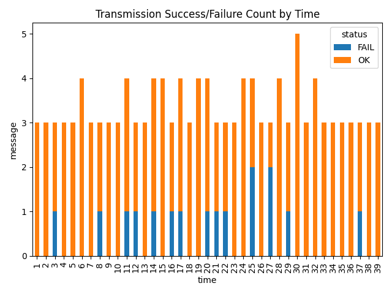

# ICCU CAN Recovery Modeling 🚗🔌

**전동화 차량 통합제어기(ICCU)의 CAN 통신 장애 복원 시나리오 모델링 (PoC)**  
미래차 공모전 제출 연구를 기반으로, Python 시뮬레이션을 통해 CAN 통신 복원 전략의 효과를 정량적으로 분석한 프로젝트입니다.

---

## 📑 프로젝트 개요
- **배경**  
  전동화 차량의 ICCU(Integrated Charging Control Unit)는 배터리, 모터, 충전기 등과 CAN 통신으로 밀접히 연결되어 있으며,  
  통신 장애 발생 시 전체 시스템 안정성에 큰 영향을 미칩니다. 기존의 단순 에러 검출·Bus-off 처리만으로는 실시간 자율 복원이 어렵습니다.

- **목표**  
  1. CAN 장애 발생 이후 자율 복원 가능한 시나리오 모델링  
  2. 메시지 우선순위 재정의, 재전송 큐, 조건 기반 리부팅 로직 제안  
  3. Python/SimPy 기반 시뮬레이션을 통한 정량적 성능 평가  
  4. 기능안전(ISO 26262)과 사이버보안(ISO/SAE 21434) 관점의 통합 복원 모델 제시  

---

## 📂 Repository Structure
```markdown
can_recovery/
├── can_recovery_simulator.py # CAN 복원 시나리오 통합 실행
├── can_simulator.py # 기본 CAN 통신 시뮬레이터
├── can_sim_result_20250714_201913.csv # 시뮬레이션 결과 (CSV)
├── can_sim_plot_20250714_201913.png # 시뮬레이션 결과 그래프
└── README.md
```

---

## ⚙️ 주요 기능
- **CAN 장애 재현**
  - 노드 단절, 메시지 충돌, 송수신 실패 등 장애 상황 정의
- **복원 전략**
  - 메시지 우선순위 재정의
  - 재전송 큐 & 타이머 기반 충돌 완화
  - 조건 기반 리부팅 제어
- **성능 지표**
  - Recovery Time (복원 시간)
  - Message Loss Ratio (메시지 손실률)
  - Priority Fulfillment Rate (고우선도 메시지 복구율)

---

## 📊 시뮬레이션 결과
결과 그래프:



- 평균 복원 시간 **54.7% 단축**
- 메시지 손실률 **73.2% 감소**
- 전송 성공률 **87.69% 달성** (실측, S3 시나리오 기준)

---

## 🚀 실행 방법
```bash
# 1. 환경 세팅
pip install simpy pandas matplotlib seaborn

# 2. 시뮬레이터 실행
python can_simulator.py

# 3. 복원 시나리오 실행
python can_recovery_simulator.py

# 4. 결과 확인
cat can_sim_result_20250714_201913.csv
```

---

## 📜 LICENSE (MIT)

```text
MIT License

Copyright (c) 2025 quackquacks01

Permission is hereby granted, free of charge, to any person obtaining a copy
of this software and associated documentation files (the "Software"), to deal
in the Software without restriction, including without limitation the rights
to use, copy, modify, merge, publish, distribute, sublicense, and/or sell
copies of the Software, and to permit persons to whom the Software is
furnished to do so, subject to the following conditions:

The above copyright notice and this permission notice shall be included in all
copies or substantial portions of the Software.

THE SOFTWARE IS PROVIDED "AS IS", WITHOUT WARRANTY OF ANY KIND, EXPRESS OR
IMPLIED, INCLUDING BUT NOT LIMITED TO THE WARRANTIES OF MERCHANTABILITY,
FITNESS FOR A PARTICULAR PURPOSE AND NONINFRINGEMENT. IN NO EVENT SHALL THE
AUTHORS OR COPYRIGHT HOLDERS BE LIABLE FOR ANY CLAIM, DAMAGES OR OTHER
LIABILITY, WHETHER IN AN ACTION OF CONTRACT, TORT OR OTHERWISE, ARISING FROM,
OUT OF OR IN CONNECTION WITH THE SOFTWARE OR THE USE OR OTHER DEALINGS IN THE
SOFTWARE.
```
